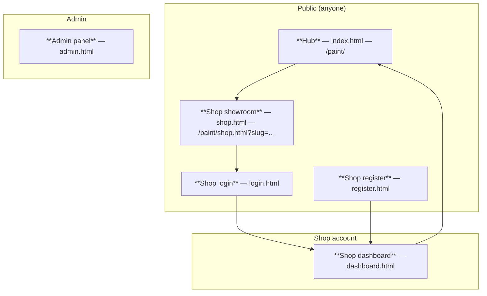
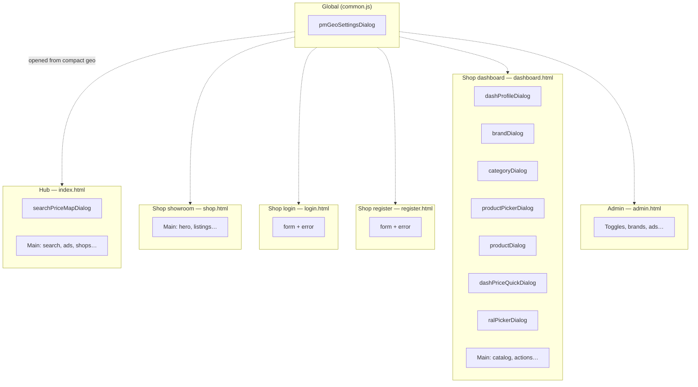
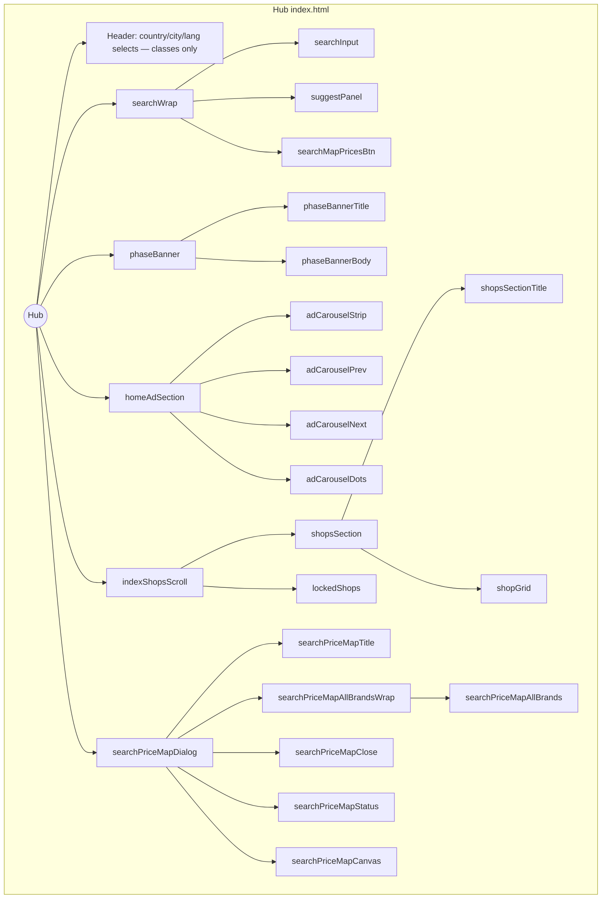
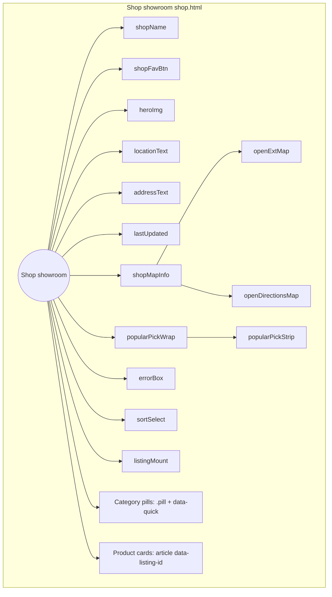
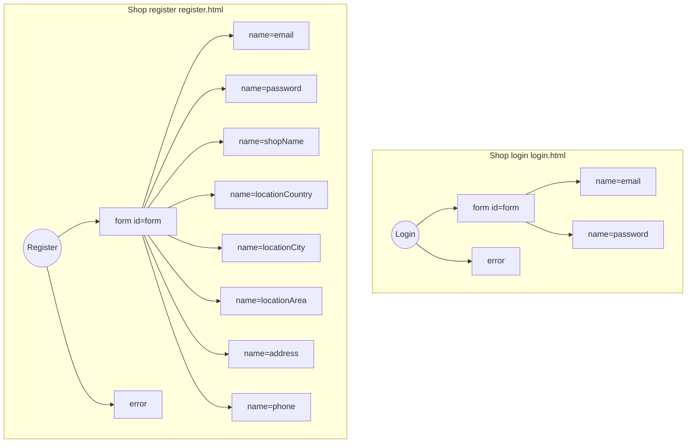
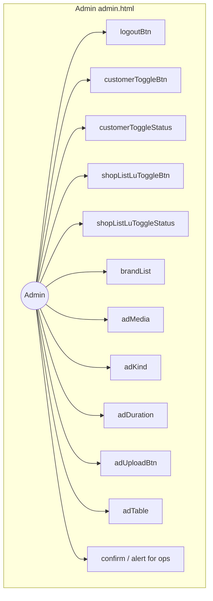
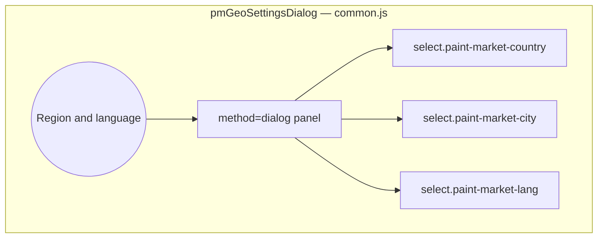

# Paint Market — page map

Use the **short names** below when you ask for changes (e.g. “on **Hub**…”, “in **Shop showroom**…”).

All customer-facing HTML is served under the `/paint/` path prefix (see `server.js` static mount).

---

## Diagram

---

## Pages

| Short name        | File                    | Typical URL                         | Role                                        |
| ----------------- | ----------------------- | ----------------------------------- | ------------------------------------------- |
| **Hub**           | `public/index.html`     | `/paint/`                           | Search, map, shop directory, ads            |
| **Shop showroom** | `public/shop.html`      | `/paint/shop.html?slug=…`           | Customer view: one shop’s product grid       |
| **Shop login**    | `public/login.html`     | `/paint/login.html`                 | Shop owner sign-in                          |
| **Shop register** | `public/register.html`  | `/paint/register.html`              | New shop signup                             |
| **Shop dashboard**| `public/dashboard.html` | `/paint/dashboard.html`             | Owner: catalog, add/update products, profile |
| **Admin panel**   | `public/admin.html`     | `/paint/admin.html`                 | Operators (e.g. ads, brands)                |

---

## Shared front-end (not separate pages)

| Name           | Path                         | Role                          |
| -------------- | ---------------------------- | ----------------------------- |
| Shared UI CSS  | `public/css/paint-market-ui.css` | Layout, cards, overlays  |
| i18n           | `public/js/paint-i18n.js`    | Copy / translations           |
| API helper     | `public/js/common.js`        | `PaintApi`, geo, favourites   |
| RAL / colours  | `public/js/ral-colors.js`    | Swatches, pickers             |
| Theme          | `public/js/theme.js`         | Brand/category styling        |

---

## Dialog boxes & named objects (reference)

When you say “change `#searchPriceMapDialog`” or “the **Region & language** dialog”, use the tables below. **`id`** is the HTML attribute; **`name`** is form field name (for `FormData`).

### Global — Region & language (not in a static HTML file)

| Display name | `id` | Where it appears |
| ------------ | ---- | ----------------- |
| **Region & language** | `pmGeoSettingsDialog` | Created in `public/js/common.js` (`paintMarketEnsureGeoDialog`). Class `pm-geo-dialog`. Opens from `.pm-geo-compact-btn` (mobile) on pages that include that button. |

Inside that dialog: country / city / language are `<select class="paint-market-country|paint-market-city|paint-market-lang">` (no fixed `id`).

---

### Hub (`public/index.html`) — **Hub**

#### Dialog (`<dialog>`)

| Display name | `id` |
| ------------ | ---- |
| **Shop prices on map** | `searchPriceMapDialog` |

**Inside `searchPriceMapDialog`:** `searchPriceMapTitle`, `searchPriceMapAllBrandsWrap`, `searchPriceMapAllBrands` (checkbox), `searchPriceMapClose`, `searchPriceMapStatus`, `searchPriceMapCanvas` (Leaflet map).

#### Other named objects (no dialog)

| Display name | `id` |
| ------------ | ---- |
| Search row wrapper | `searchWrap` |
| Search field | `searchInput` |
| Search suggestions dropdown | `suggestPanel` |
| Open map from header | `searchMapPricesBtn` |
| Phase / access banner | `phaseBanner`, `phaseBannerTitle`, `phaseBannerBody` |
| Home ads section | `homeAdSection` |
| Ad carousel | `adCarouselStrip`, `adCarouselPrev`, `adCarouselNext`, `adCarouselDots` |
| Shops scroll area | `indexShopsScroll` |
| Shops section | `shopsSection`, `shopsSectionTitle`, `shopGrid` |
| Locked customer view | `lockedShops` |

**Header selects:** class `paint-market-country`, `paint-market-city`, `paint-market-lang` (no `id`).

---

### Shop showroom (`public/shop.html`) — **Shop showroom**

**No `<dialog>`** on this page.

| Display name | `id` |
| ------------ | ---- |
| Shop title | `shopName` |
| Favourite button | `shopFavBtn` |
| Hero image | `heroImg` |
| Location / address / last update | `locationText`, `addressText`, `lastUpdated` |
| Map links box | `shopMapInfo` |
| External map / directions links | `openExtMap`, `openDirectionsMap` |
| Popular picks wrapper / grid | `popularPickWrap`, `popularPickStrip` |
| Error / status message | `errorBox` |
| Sort dropdown | `sortSelect` |
| Product listing mount | `listingMount` |

**Category filter:** buttons use class `pill` and `data-quick` (no single `id`).

**Product cards:** `<article data-listing-id="…">` (set in JS).

---

### Shop login (`public/login.html`) — **Shop login**

**No `<dialog>`** in markup (geo dialog is global).

| Display name | `id` / `name` |
| ------------ | ------------- |
| Login form | `id="form"` |
| Error line | `id="error"` |
| Email field | `name="email"` |
| Password field | `name="password"` |

---

### Shop register (`public/register.html`) — **Shop register**

**No `<dialog>`** in markup.

| Display name | `id` / `name` |
| ------------ | ------------- |
| Register form | `id="form"` |
| Error line | `id="error"` |
| Email | `name="email"` |
| Password | `name="password"` |
| Shop name | `name="shopName"` |
| Country / city | `name="locationCountry"`, `name="locationCity"` |
| Area | `name="locationArea"` |
| Address | `name="address"` |
| Phone | `name="phone"` |

---

### Shop dashboard (`public/dashboard.html`) — **Shop dashboard**

#### All dialog boxes (`<dialog id="…">`)

| Display name (say this) | `id` |
| ------------------------- | ---- |
| **Shop profile** | `dashProfileDialog` |
| **Brand picker** | `brandDialog` |
| **Category picker** | `categoryDialog` |
| **Product picker** | `productPickerDialog` |
| **Add / edit product** | `productDialog` |
| **Quick update prices** | `dashPriceQuickDialog` |
| **RAL picker** | `ralPickerDialog` |

#### Objects inside **Shop profile** (`dashProfileDialog`)

| Display name | `id` |
| ------------ | ---- |
| Profile panel scroll body | `dashProfilePanel` |
| Shop logo image / placeholder | `shopPhoto`, `shopPhotoPlaceholder` |
| Logo file input | `shopPhotoInput` |
| Country / city / area | `fldLocationCountry`, `fldLocationCity`, `fldLocationArea` |
| Phone / address | `fldPhone`, `fldAddress` |
| Map + coords | `shopMapPicker`, `mapGeoBtn`, `mapClearPinBtn`, `mapCoordsLabel`, `fldLat`, `fldLng` |
| Save profile | `saveProfile` |

#### Objects inside **Brand picker** (`brandDialog`)

| Display name | `id` |
| ------------ | ---- |
| Brand grid | `brandPickerList` |
| New brand name / add | `brandNewName`, `brandAddBtn` |

#### Objects inside **Category picker** (`categoryDialog`)

| Display name | `id` |
| ------------ | ---- |
| Brand context label | `categoryDialogBrandLabel` |
| Category grid | `categoryPickerList` |
| Back to brands | `categoryBackBtn` |

#### Objects inside **Product picker** (`productPickerDialog`)

| Display name | `id` |
| ------------ | ---- |
| Context: brand / sep / category | `productPickerBrand`, `productPickerContextSep`, `productPickerCategory` |
| New product shortcut | `productPickerNewBtn` |
| Product grid | `productPickerList` |

#### Objects inside **Add / edit product** (`productDialog`)

| Display name | `id` |
| ------------ | ---- |
| Context row (brand · category) | `productDialogContextRow`, `productDialogBrand`, `productDialogCategory` |
| Step line / title | `productDialogStep`, `productDialogTitle` |
| Intro / hints | `productDialogIntro`, `productDialogHint`, `productDialogAddHint` |
| Hidden ids | `pdProductId`, `pdCurrentPhotoUrl`, `pdBrandId`, `pdCategoryId` |
| Category row | `pdCategoryRow`, `pdCategorySelect` |
| Name / description | `pdNameBlock` + `pdName`, `pdDescBlock` + `pdDesc` |
| Capacity, price, RAL block | `pdAddFields`, `pdCapacity`, `pdPrice`, `pdRalBlock`, `pdRalSelected`, `pdRalCode`, `pdRalGrid`, `pdRalCustomName`, `pdRalCustomHex`, `pdRalCustomAddBtn` |
| Photo | `pdPhotoBlock`, `pdPhotoPreviewWrap`, `pdPhotoPreview`, `pdPhoto` |
| Update-mode product select | `pdPickWrap`, `pdPickProduct` |
| Stock & prices rows | `pdUpdateListings`, `pdUpdateListingRows` |
| Submit | `pdSubmit` |

#### Objects inside **Quick update prices** (`dashPriceQuickDialog`)

| Display name | `id` |
| ------------ | ---- |
| Listing grid | `dashPriceQuickListWrap` |
| Edit panel | `dashPriceQuickEdit` |
| Edit label / capacity / RAL slot | `dashPriceQuickEditLabel`, `dashPriceQuickCapBlock`, `dashPriceQuickCapLtr`, `dashPriceQuickCapRal` |
| Price / RAL | `dashPriceQuickInput`, `dashPriceQuickRalCode`, `dashPriceQuickRalBtn`, `dashPriceQuickRalSwatch`, `dashPriceQuickRalLabel` |
| Back / save | `dashPriceQuickBack`, `dashPriceQuickSave` |
| Empty state | `dashPriceQuickEmpty` |

#### Objects inside **RAL picker** (`ralPickerDialog`)

| Display name | `id` |
| ------------ | ---- |
| Swatch grid | `ralPickerGrid` |
| Custom colour | `ralCustomName`, `ralCustomHex`, `ralCustomAddBtn` |

#### Main page (not in a dialog)

| Display name | `id` |
| ------------ | ---- |
| Header title / nav | `shopTitle`, `dashEditProfileBtn`, `logoutBtn` |
| Actions | `dashAddProductBtn`, `dashUpdateProductBtn` |
| Recent block | `dashRecentSection`, `dashRecentList` |
| Catalogue | `dashCatalogSection`, `dashCatalogFilter`, `dashCatalogCount`, `dashCatalogList`, `dashCatalogEmpty` |

#### Messages

| Display name | `id` / mechanism |
| ------------ | ---------------- |
| Toast template | `toastTpl` (cloned for each toast) |
| Toasts | JS `toast(…)` |
| API errors | JS `showErr(…)` |

---

### Admin panel (`public/admin.html`) — **Admin panel**

**No `<dialog>`** in markup.

| Display name | `id` |
| ------------ | ---- |
| Logout | `logoutBtn` |
| Customer access toggle + status | `customerToggleBtn`, `customerToggleStatus` |
| Shop list “last update” toggle + status | `shopListLuToggleBtn`, `shopListLuToggleStatus` |
| Brand reorder list | `brandList` |
| Hero ads | `adMedia`, `adKind`, `adDuration`, `adUploadBtn`, `adTable` |

**Browser dialogs (not HTML `id`):** `confirm(…)` before ad delete; `alert(…)` for feedback / “pick file”.

**Ad row buttons:** `data-action` / `data-id` on buttons inside `#adTable` (from JS).

---

## Object tree diagrams (graphical)

These **Mermaid** trees match the `id` / `name` inventory above. Render this file in a Markdown preview that supports Mermaid (GitHub, VS Code, Cursor).

### Overview — pages and dialogs

### Hub — object tree

### Shop showroom — object tree

### Shop login & register — object tree

### Shop dashboard — dialogs tree

```mermaid
flowchart TB
  subgraph Dash["Shop dashboard dashboard.html"]
    M((Main page))
    M --> shopTitle
    M --> dashEditProfileBtn
    M --> logoutBtn
    M --> dashAddProductBtn
    M --> dashUpdateProductBtn
    M --> dashRecentSection
    dashRecentSection --> dashRecentList
    M --> dashCatalogSection
    dashCatalogSection --> dashCatalogFilter
    dashCatalogSection --> dashCatalogCount
    dashCatalogSection --> dashCatalogList
    dashCatalogSection --> dashCatalogEmpty

    M --> dashProfileDialog
    M --> brandDialog
    M --> categoryDialog
    M --> productPickerDialog
    M --> productDialog
    M --> dashPriceQuickDialog
    M --> ralPickerDialog
    M --> toastTpl[toastTpl template]

    dashProfileDialog --> DPF[dashProfilePanel]
    DPF --> shopPhoto
    DPF --> shopPhotoPlaceholder
    DPF --> shopPhotoInput
    DPF --> fldLocationCountry
    DPF --> fldLocationCity
    DPF --> fldLocationArea
    DPF --> fldPhone
    DPF --> fldAddress
    DPF --> shopMapPicker
    DPF --> mapGeoBtn
    DPF --> mapClearPinBtn
    DPF --> mapCoordsLabel
    DPF --> fldLat
    DPF --> fldLng
    DPF --> saveProfile

    brandDialog --> brandPickerList
    brandDialog --> brandNewName
    brandDialog --> brandAddBtn

    categoryDialog --> categoryDialogBrandLabel
    categoryDialog --> categoryPickerList
    categoryDialog --> categoryBackBtn

    productPickerDialog --> productPickerBrand
    productPickerDialog --> productPickerContextSep
    productPickerDialog --> productPickerCategory
    productPickerDialog --> productPickerNewBtn
    productPickerDialog --> productPickerList

    productDialog --> productDialogContextRow
    productDialogContextRow --> productDialogBrand
    productDialogContextRow --> productDialogCategory
    productDialog --> productDialogStep
    productDialog --> productDialogTitle
    productDialog --> productDialogIntro
    productDialogIntro --> productDialogHint
    productDialogIntro --> productDialogAddHint
    productDialog --> pdProductId
    productDialog --> pdCurrentPhotoUrl
    productDialog --> pdBrandId
    productDialog --> pdCategoryId
    productDialog --> pdCategoryRow
    pdCategoryRow --> pdCategorySelect
    productDialog --> pdNameBlock
    pdNameBlock --> pdName
    productDialog --> pdDescBlock
    pdDescBlock --> pdDesc
    productDialog --> pdAddFields
    pdAddFields --> pdCapacity
    pdAddFields --> pdPrice
    productDialog --> pdRalBlock
    pdRalBlock --> pdRalSelected
    pdRalBlock --> pdRalCode
    pdRalBlock --> pdRalGrid
    pdRalBlock --> pdRalCustomName
    pdRalBlock --> pdRalCustomHex
    pdRalBlock --> pdRalCustomAddBtn
    productDialog --> pdPhotoBlock
    pdPhotoBlock --> pdPhotoPreviewWrap
    pdPhotoPreviewWrap --> pdPhotoPreview
    pdPhotoBlock --> pdPhoto
    productDialog --> pdPickWrap
    pdPickWrap --> pdPickProduct
    productDialog --> pdUpdateListings
    pdUpdateListings --> pdUpdateListingRows
    productDialog --> pdSubmit

    dashPriceQuickDialog --> dashPriceQuickListWrap
    dashPriceQuickDialog --> dashPriceQuickEdit
    dashPriceQuickEdit --> dashPriceQuickEditLabel
    dashPriceQuickEdit --> dashPriceQuickCapBlock
    dashPriceQuickCapBlock --> dashPriceQuickCapLtr
    dashPriceQuickCapBlock --> dashPriceQuickCapRal
    dashPriceQuickEdit --> dashPriceQuickInput
    dashPriceQuickEdit --> dashPriceQuickRalCode
    dashPriceQuickEdit --> dashPriceQuickRalBtn
    dashPriceQuickRalBtn --> dashPriceQuickRalSwatch
    dashPriceQuickRalBtn --> dashPriceQuickRalLabel
    dashPriceQuickEdit --> dashPriceQuickBack
    dashPriceQuickEdit --> dashPriceQuickSave
    dashPriceQuickDialog --> dashPriceQuickEmpty

    ralPickerDialog --> ralPickerGrid
    ralPickerDialog --> ralCustomName
    ralPickerDialog --> ralCustomHex
    ralPickerDialog --> ralCustomAddBtn
  end
```

### Admin panel — object tree

### Global — Region & language dialog tree

---

## Example prompts

- “Change **Shop showroom** so price and capacity don’t overlap.”
- “On **Hub**, update `#suggestPanel`.”
- “In **Shop dashboard**, fix `#productPickerDialog`.”
- “**Admin panel** — only `#adTable` and `#adUploadBtn`.”
